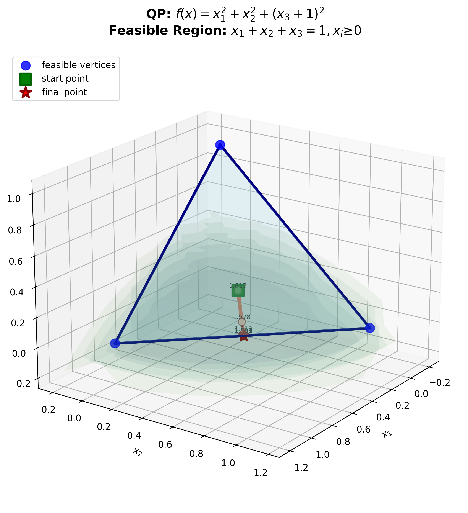
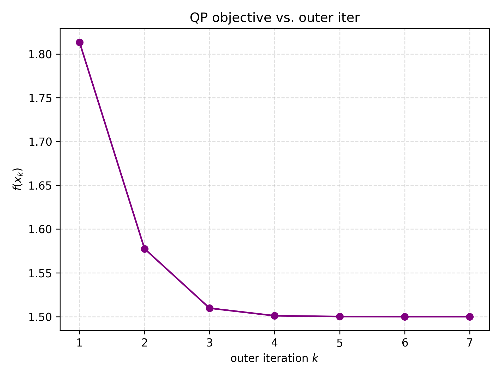
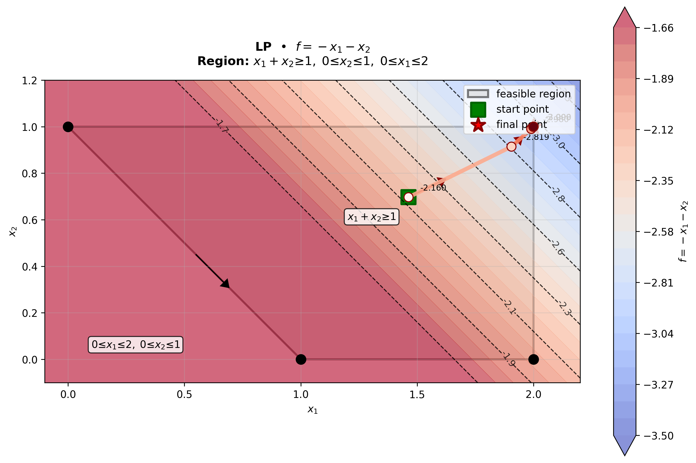
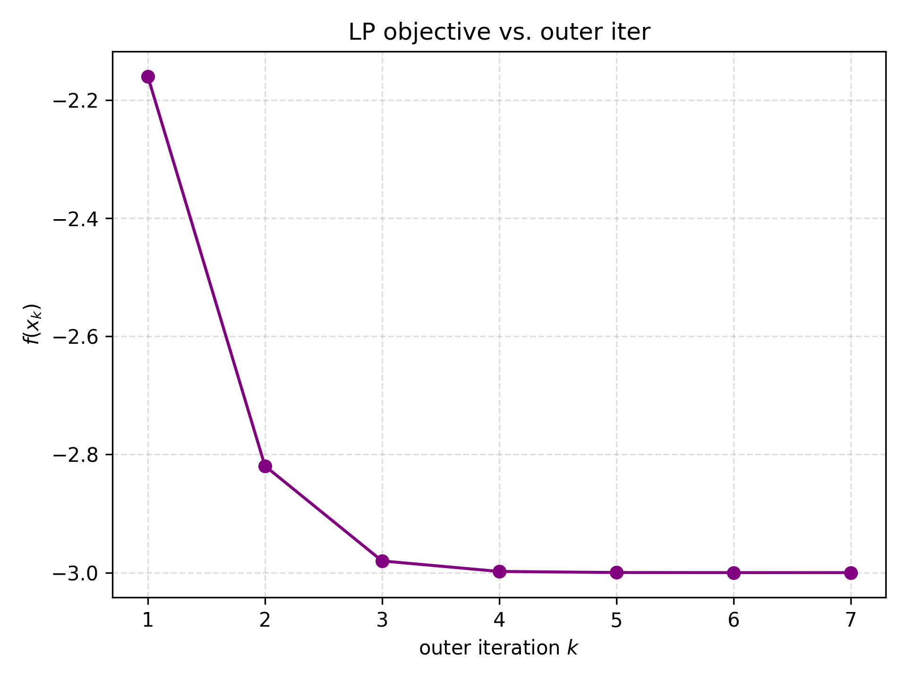

# Constrained Minimization Task Report

**GitHub Repository:** [PyOPT-Task2](https://github.com/vaknin34/PyOPT-Task2)

---

## Quadratic Programming (QP) Solution

- **Optimal Solution:**  
    `x* = [0.4999995, 0.4999995, 0.000000999993609]`
- **Objective Value:**  
    `1.500001`
- **Inequality Constraints at x\*:**  
    - Constraint 1: `c₁(x*) = -0.4999995`
    - Constraint 2: `c₂(x*) = -0.4999995`
    - Constraint 3: `c₃(x*) = -0.000000999993609`
- **Equality Residuals:**  
    `[-1.11022302e-16]`

**Central Path Plot:**  

**Objective Function Plot:**  

---

## Linear Programming (LP) Solution

- **Optimal Solution:**  
    `x* = [1.999999, 0.999999]`
- **Objective Value:**  
    `-2.999998`
- **Inequality Constraints at x\*:**  
    - Constraint 1: `c₁(x*) = -1.999998`
    - Constraint 2: `c₂(x*) = -0.000000999997129`
    - Constraint 3: `c₃(x*) = -0.000000999998110`
    - Constraint 4: `c₄(x*) = -0.999999`

**Central Path Plot:**  

**Objective Function Plot:**  
